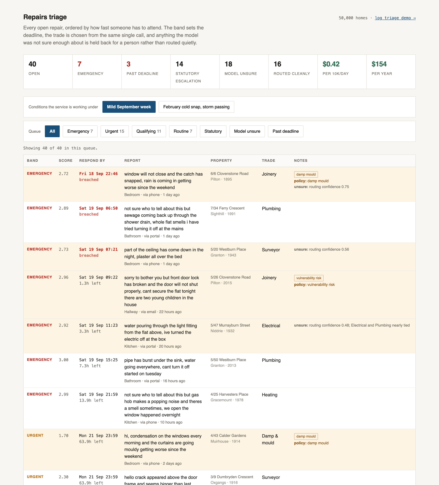

# Laravel Smart Triage — demo

A repairs service for 50,000 homes, used to exercise
[Laravel Smart Triage](https://github.com/Robincodes-Sandbox/laravel-smart-triage).



Every open repair is listed in deadline order. The band sets the deadline, the trade comes from
the same single call, and anything the model was not sure enough about is held back for a person
instead of being routed quietly.

## What it shows

- 40 repair reports, written the way tenants actually write them, against 50,000 seeded properties
- 6 judgements per report from one request: urgency, trade and 4 conditions
- urgency bands that carry their own deadline, so a band change moves the SLA with it
- policy escalation and model uncertainty counted separately, because they are different queues
- the same reports re-triaged against different operating conditions, to show what context changes

## Run it

```bash
composer install
cp .env.example .env && php artisan key:generate
php artisan migrate --seed
php artisan triage:run "App\Models\RepairReport"
php artisan serve
```

You need a TypeSafe key in `.env` as `JEV_API_KEY`. Triaging the 40 seeded reports costs about
$0.002.

The package itself lives in `packages/laravel-smart-triage` and is linked in through a path
repository. That directory is pushed to the package repository with `git subtree`.

## The demo lock

The deployed copy is gated. `config/demo.php` holds the settings:

```dotenv
DEMO_LOCK=true
DEMO_LOCK_PASSWORD=
DEMO_TRIAGE_PER_HOUR=10
```

It fails closed. With the lock on and no password set, nothing gets through, which is the right
answer when an environment variable goes missing on a server. The routes that spend tokens are
rate limited as well as locked. Set `DEMO_LOCK=false` for local work.

## Deploying

`deploy.json` is set to `"live": false`. To put it on `solarise.dev`, do both of these:

1. Put an `.env` in the server's shared path at `/srv/solarise/projects/laravel-smart-triage/shared/.env`, with `JEV_API_KEY`, `DEMO_LOCK=true` and a `DEMO_LOCK_PASSWORD`.
2. Set `"live": true` in `deploy.json` and push to `main`.

Without step 1 the deployed app has no key and no lock password, so it would serve errors.

## Licence

MIT.
